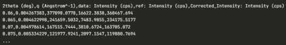
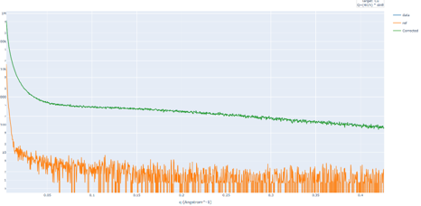
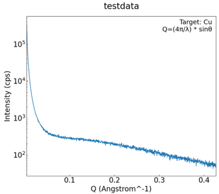
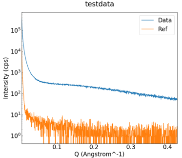
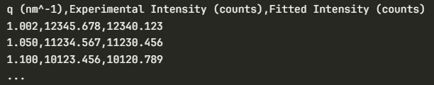
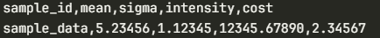
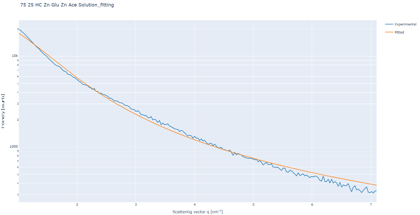
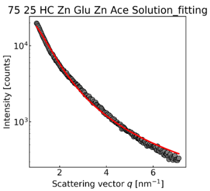
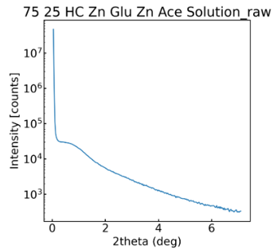
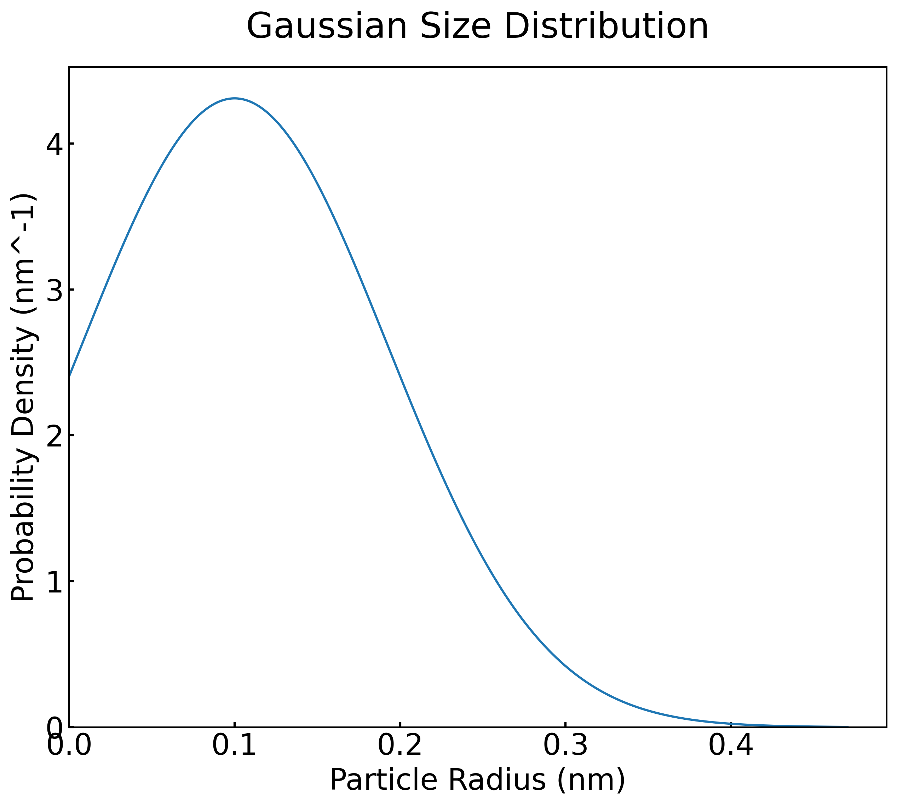

# SAXSデータセットテンプレート

## 概要

SAXS（小角X線散乱）をご利用の方に適したテンプレートです。Rigaku社のras、rasx、またはCSVフォーマットで取得されたSAXSデータを登録し、可視化および解析を行うことができます。<br>
SAXSの専門家によって監修されたメタ情報をデータファイルから自動的にRDEが抽出します。測定データの可視化に加え、テンプレートに応じて差分進化アルゴリズム（Differential Evolution, DE）を用いたフィッティング解析を実行しします。


## カタログ番号

本テンプレートには、解析内容および対応フォーマットの違いによって以下のバリエーションが提供されています。

- DT0026
  - Rigaku SAXS
- DT0027
  - Rigaku SAXS_fitting
- DT0028
  - Custom SAXS_fitting_CSV


## 登録できるデータ

本データセットテンプレートで作成したデータセットには、`データファイル`と`構造化ファイル`と`メタ情報`を登録することができます。なお、データファイルは１つ登録する必要があります。

### 入力ファイル

| カタログ番号  | 対応ファイルフォーマット  | 備考|
| ------------- | ------------------- |  ------------- |
| **DT0026**    | `.ras`, `.rasx`|  Rigaku形式向け |
| **DT0027**    |  `.ras`, `.rasx`   |  Rigaku形式向け     |
| **DT0028**    | `.csv`  |  SAXSデータセットで変換(出力)したCSV形式    |

### 入力ファイル仕様

* 入力ファイルの投入パターンはカタログ番号ごとに以下の通りとする。

---

#### DT0026（SAXSテンプレート）

以下のいずれかの形式で投入可能。

* 入力データのみ

  * `{filename}.ras` (テキストデータ)
  * `{filename}.rasx` (バイナリデータ)

* 入力データ＋リファレンスデータ

  * `{filename}.ras` または `{filename}.rasx`
  * `{filename}_***.ras`（リファレンスデータ）

**リファレンスデータの命名規則**

* リファレンスデータは、入力データと区別するため
  **入力データファイル名より長い文字列とすること**
* 例：
  * 入力：`testdata.ras`
  * リファレンス：`testdata_ref001.ras` など

---

#### DT0027 / DT0028（SAXS_fitting / SAXS_fitting_CSV）

以下のいずれかの形式で投入可能（単一入力）。

* DT0027（XRD/SAXS fitting）

  * `{filename}.ras`
  * `{filename}.rasx`

* DT0028（CSV入力）

  * `{filename}.csv`

**csvデータ仕様**

SAXSデータセットで出力したCSVファイルを入力として使用する。  
CSVは以下のいずれかの形式を受け付ける。

  - SAXSデータセットで出力した、バックグラウンド除去ありのcsvデータ
    ```csv
    2Theta (deg),q (Angstrom^-1),data: Intensity (counts),ref: Intensity (counts),Corrected: Intensity (counts)
    0.06,0.004267383236821752,569958.25,14990.6514,554967.5986
    0.065,0.004622998469883829,365259.75,6749.3218,358510.4282
    0.07,0.004978613694144368,253194.0938,3436.5986,249757.4952
    ...
    ```
  - SAXSデータセットで出力した、バックグラウンド除去なしのcsvデータ
    ```csv
    2Theta (deg),q (Angstrom^-1),data: Intensity (counts)
    0.06,0.004267383236821752,569958.25
    0.065,0.004622998469883829,365259.75
    0.07,0.004978613694144368,253194.0938
    ...
    ```

### 出力ファイル詳細

#### DT0026（SAXSテンプレート）

| No | ファイル種別     | ファイル名    | 内容   | 備考     |
| -- | ---------- | -------------------------- | ---------------------------- | ------ |
| 1  | rawデータファイル | {filename}.ras / {filename}.rasx | 入力ファイル | |
| 2  | rawデータファイル  | {filename}_***.ras / {filename}.rasx| リファレンスデータ | 命名規則あり |
| 3  | メタデータファイル | metadata.json  | 主要パラメータメタ情報ファイル  |  |
| 4  | 構造化ファイル | {filename}.csv    | 代表画像元データ|  |
| 5  | 構造化ファイル | {filename}.html   | 画像プロットhtml |  |
| 6  | 構造化ファイル | Profile0.txt   | 測定データ     | rasx入力時のみ出力 |
| 7  | 構造化ファイル | MeasurementConditions0.xml | 測定条件メタ情報  | rasx入力時のみ出力 |
| 8  | 代表画像ファイル      | {filename}.png    | SAXSプロット画像    |  |
| 9  | 画像ファイル      | {filename}_raw_ref.png      | 生データとリファレンスデータの比較画像|  |

* 構造化ファイルのHTML形式ファイルはplotlyにより生成されたグラフファイルです。
---

#### DT0027 / DT0028（SAXS_fitting / SAXS_fitting_CSV）

| No | ファイル種別    | ファイル名     | 内容      | 備考  |
| -- | --------------- | --------------------------- | ------------------- | --------------- |
| 1  | rawデータファイル     | {filename}.ras / {filename}.rasx  / {filename}.csv   | 入力データ   |  |   |
| 2  | 構造化ファイル      | metadata.json   | 主要パラメータメタ情報ファイル     |     |
| 3  | 構造化ファイル      | {filename}_fitting.csv      | フィッティング結果数値データ      |     |
| 4  | 構造化ファイル      | {filename}_fitting.log      | 処理ログ    |     |
| 5  | 構造化ファイル      | saxs_fitting_results.csv    | 全サンプル集約結果     |     |
| 6  | 構造化ファイル | {filename}_fitting.html     | フィッティング結果HTML|   |
| 7  | 構造化ファイル | {filename}_raw.html   | 生データHTML（Log Scale） |   |
| 8  | 代表画像ファイル     | {filename}_fitting.png      | フィッティング結果プロット|  |
| 9  | 画像ファイル     | {filename}.png  | 生データプロット(フィッティング処理前)      |   |
| 10  | 画像ファイル     | gaussian_distribution_{filename}.png | 粒子サイズ分布（ガウス曲線）      ||

* 構造化ファイルのHTML形式ファイルはplotlyにより生成されたグラフファイルです。
---

### メタ情報

次のように、大きく４つに分類されます。

- 基本情報
- 固有情報
- 試料情報
- 抽出メタ情報

#### 基本情報

基本情報はすべてのデータセットテンプレート共通のメタです。詳細は[データセット閲覧 RDE Dataset Viewer > マニュアル](https://dice.nims.go.jp/services/RDE/RDE_manual.pdf)を参照してください。

#### 固有情報

固有情報はデータセットテンプレート特有のメタです。以下は本データセットテンプレートに設定されている固有メタ情報項目です。
#### DT0026（SAXSテンプレート）

| 項目名    | 必須 | 日本語名| 英語名     | データ型    | 初期値   | 単位 | 備考    |
| -------------------- | -- | ---------- | -------------- | ------------- | ----------- | -- | ------------- |
| measurement_temperature  | -  | 測定温度| Measurement Temperature   | number  | -     | C  ||
| sample_holder_name| -  | 試料ホルダー名    | Sample Holder Name  | string  | -     |    ||
| key1   | -  | キー1  | key1    | string  | -     |    |   汎用項目    |
| key2   | -  | キー2  | key2    | string  | -     |    |   汎用項目    |
| key3   | -  | キー3  | key3    | string  | -     |    |   汎用項目    |
| key4   | -  | キー4  | key4    | string  | -     |    |   汎用項目    |
| key5   | -  | キー5  | key5    | string  | -     |    |   汎用項目    |
| common_data_type   | -  | 登録データタイプ   | Data type     | string  | SAXS  |    ||
| common_data_origin| -  | データの起源     | Data Origin   | string  | experiments |    ||
| common_technical_category      | -  | 技術カテゴリー    | Technical Category  | string  | measurement |    ||
| common_reference   | -  | 参考文献| Reference     | string  | -     |    ||
| measurement_method_category    | -  | 計測法カテゴリー   | Method category     | string  | 散乱_回折|    ||
| measurement_method_sub_category      | -  | 計測法サブカテゴリー | Method sub-category| string  | X線回折  |    ||
| measurement_analysis_field     | -  | 分析分野| Analysis field      | string  | -     |    ||
| measurement_measurement_environment  | -  | 測定環境| Measurement environment   | string  | -     |    ||
| measurement_energy_level_transition_structure_etc_of_interest | -  | 対象準位_遷移_構造 | Energy level_transition_structure etc. of interst | string  | -     |    |  |
| measurement_measured_date      | -  | 分析年月日      | Measured date| string (date) | -     |    | 装置情報から自動取得     |
| measurement_standardized_procedure   | -  | 標準手順| Standardized procedure    | string  | -     |    ||
| measurement_instrumentation_site     | -  | 装置設置場所     | Instrumentation site      | string  | -     |    ||

#### DT0027 / DT0028（SAXS_fitting / SAXS_fitting_CSV）

| 項目名    | 必須 | 日本語名      | 英語名    | データ型    | 初期値  | 単位 | 備考     |
| -------------- | -- | --------------- | ---------- | ------------- | -------- | -- | ----------- |
| mean   | -  | 平均半径 (最小, 最大)   | Mean (min, max)    | string  | (0.1, 50.0)      | nm |  |
| sigma  | -  | 標準偏差 (最小, 最大)   | Sigma (min, max)   | string  | (0.05, 10.0)     | nm |  |
| h_log  | -  | 散乱強度 (最小, 最大)   | H Log (min, max)   | string  | (2.0, 6.0)|    |  |
| common_data_type   | -  | 登録データタイプ  | Data type    | string  | SAXSfitting      |    |  |
| common_data_origin| -  | データの起源    | Data Origin  | string  | experiments      |    |  |
| common_technical_category      | -  | 技術カテゴリー   | Technical Category | string  | calculation      |    |  |
| common_reference   | -  | 参考文献      | Reference    | string  | -    |    |  |
| calculation_calculation_method | -  | 計算方法      | Calculation method | string  | 機械学習, 差分進化アルゴリズム|    |  |
| calculation_supercom_or_pc     | -  | SuperComまたはPC   | SuperCom or PC     | string  | azure cloud      |    |  |
| calculation_os     | -  | オペレーティングシステム    | OS     | string  | Debian GNU/Linux 13 (trixie) |    |  |
| calculation_software_name      | -  | ソフトウェア名称  | Software name      | string  | SAXS差分進化フィッティング  |    |  |
| calculation_software_version   | -  | ソフトウェアバージョン     | Software version   | string  | -    |    |  |
| calculation_software_reference | -  | ソフトウェア参照  | Software reference | string  | SciPy, NumPy, joblib   |    |  |
| calculation_operator     | -  | 計算実行者     | Operator     | string  | RDE  |    |  |
| calculation_calculated_date    | -  | 計算日| Calculated date    | string (date) | -    |    | 登録日から自動取得 |
| calculation_material_name      | -  | 物質名| Material name      | string  | -    |    |  |
| calculation_key_object   | -  | キーの配列/計算される主な物性 | Key object   | string  | 粒子平均半径, 粒子サイズ分布標準偏差, 散乱強度    |    |  |

#### 試料情報

試料情報は試料に関するメタで、試料マスタ（[データセット閲覧 RDE Dataset Viewer > マニュアル](https://dice.nims.go.jp/services/RDE/RDE_manual.pdf)参照）と連携しています。以下は本データセットテンプレートに設定されている試料メタ情報項目です。

|項目名|必須|日本語語彙|英語語彙|単位|初期値|データ型|フォーマット|備考|
|:----|:----|:----|:----|:----|:----|:----|:----|:----|
|sample_name_(local_id)|x|試料名(ローカルID)|Sample name (Local ID)|||string|||
|chemical_formula_etc.||化学式・組成式・分子式など|Chemical formula etc.|||string|||
|administrator_(affiliation)|x|試料管理者(所属)|Administrator (Affiliation)|||string|||
|reference_url||参考URL|Reference URL|||string|||
|related_samples||関連試料|Related samples|||string|||
|tags||タグ|Tags|||string|||
|description||試料の説明|Description |||string|||
|sample.general.general_name||一般名称|General name|||string|||
|sample.general.cas_number||CAS番号|CAS Number|||string|||
|sample.general.crystal_structure||結晶構造|Crystal structure|||string|||
|sample.general.sample_shape||試料形状|Sample shape|||string|||
|sample.general.purchase_date||試料購入日|Purchase date|||string|||
|sample.general.supplier||購入元|Supplier|||string|||
|sample.general.lot_number_or_product_number_etc||ロット番号、製造番号など|Lot number or product number etc|||string|||

#### 抽出メタ

抽出メタ情報は、データファイルから構造化処理で抽出したメタデータです。以下は本データセットテンプレートに設定されている抽出メタ情報項目です。
(項目名の*にはデータファイルの拡張子が入ります。)

#### DT0026（SAXSテンプレート）

| 項目名     | 日本語名  | 英語名   | 単位| データ型   | 抽出元（.ras）    | 抽出元（.rasx）  | 備考      |
| ------------- | ----------- | --------------- | -------- | ------ | -------------- | ------------ | ----------- |
| main_image_setting | 代表画像の設定 | Main Image Setting | -  | string | -   | -    |  |
| *.comment     | コメント  | Comment     | -  | string | FILE_COMMENT| Comment     |   |
| *.memo  | メモ    | Memo  | -  | string | FILE_MEMO    | Memo  |   |
| *.measurement_operator    | 測定実施者| Measurement Operator    | -  | string | FILE_OPERATOR      | Operator    |   |
| *.specimen    | 試料    | Specimen    | -  | string | FILE_SAMPLE  | SampleName  |   |
| *.detector_pixel_size     | 検出器ピクセルサイズ  | Detector Pixel Size     | mm| number | HW_COUNTER_PIXEL_SIZE    | PixelSize   | .rasxでは単位情報なし|
| *.selected_detector_name  | 使用検出器名称     | Selected Detector Name  | -  | string | HW_COUNTER_SELECT_NAME   | Detector    |   |
| *.x-ray_target_material   | X線ターゲットの材質  | X-ray Target Material   | -  | string | HW_XG_TARGET_NAME  | TargetName  |   |
| *.k_alpha_1_wavelength    | K_alpha1の波長 | K_alpha_1 Wavelength    | Angstrom | number | HW_XG_WAVE_LENGTH_ALPHA1 | WavelengthKalpha1 |   |
| *.k_alpha_2_wavelength    | K_alpha2の波長 | K_alpha_2 Wavelength    | Angstrom | number | HW_XG_WAVE_LENGTH_ALPHA2 | WavelengthKalpha2 |   |
| *.k_beta_wavelength| K_betaの波長   | K_beta Wavelength| Angstrom | number | HW_XG_WAVE_LENGTH_BETA   | WavelengthKbeta   |   |
| *.optics_attribute  | 光学系属性| Optics Attribute  | -  | string | MEAS_COND_OPT_ATTR| Attribute   |   |
| *.x-ray_tube_current      | X線管電流| X-ray Tube Current      | `.ras`：`$HW_XG_CURRENT_UNIT`<br>`.rasx`：`$CurrentUnit`| number | MEAS_COND_XG_CURRENT     | Current     |  |
| *.x-ray_tube_voltage      | X線管電圧| X-ray Tube Voltage      | `.ras`：`$HW_XG_VOLTAGE_UNIT`<br>`.rasx`：`$VoltageUnit`| number | MEAS_COND_XG_VOLTAGE     | Voltage     |  |
| *.wavelength_type   | 波長タイプ| Wavelength Type   | -  | string | MEAS_COND_XG_WAVE_TYPE   | WaveType    |   |
| *.data_point_number| データ点数| Data Point Number| -  | number | MEAS_DATA_COUNT    | DataCount   |   |
| *.scan_axis   | スキャン軸| Scan Axis   | -  | string | MEAS_SCAN_AXIS_X   | AxisName    |   |
| *.scan_starting_date_time | スキャン開始時刻    | Scan Starting Date Time | -  | string | MEAS_SCAN_START_TIME     | StartTime   |   |
| *.scan_ending_date_time   | スキャン終了時刻    | Scan Ending Date Time   | -  | string | MEAS_SCAN_END_TIME| EndTime     |   |
| *.scan_mode   | スキャンモード     | Scan Mode   | -  | string | MEAS_SCAN_MODE     | Mode  |   |
| *.scan_speed  | スキャンスピード    | Scan Speed  | `.ras`：`$MEAS_SCAN_SPEED_UNIT`<br>`.rasx`：`$SpeedUnit`      | number | MEAS_SCAN_SPEED    | Speed|  |
| *.scan_step_size    | スキャンステップサイズ | Scan Step Size    | `.ras`：`$MEAS_SCAN_UNIT_X`<br>`.rasx`：`$PositionUnit`| number | MEAS_SCAN_STEP     | Step  |   |
| *.scan_starting_position  | スキャン開始位置    | Scan Starting Position  | `.ras`：`$MEAS_SCAN_UNIT_X`<br>`.rasx`：`$PositionUnit`| number | MEAS_SCAN_START    | Start|   |
| *.scan_ending_position    | スキャン終了位置    | Scan Ending Position    | `.ras`：`$MEAS_SCAN_UNIT_X`<br>`.rasx`：`$PositionUnit`| number | MEAS_SCAN_STOP     | Stop  |   |
| *.scan_axis_unit    | スキャン軸の単位    | Scan Axis Unit    | -  | string | MEAS_SCAN_UNIT_X   | PositionUnit      |   |
| *.intensity_unit    | 強度の単位| Intensity Unit    | -  | string | MEAS_SCAN_UNIT_Y   | IntensityUnit     |   |

#### DT0027（SAXS_fitting）

| 項目名  | 日本語名      | 英語名  | 単位 | データ型   | 抽出元（.ras） | 抽出元（.rasx） | 備考      |
| ------------------ | --------- | ------------------ | -- | ------ | --------- | ---------- | --------------------- |
| main_image_setting | 代表画像の設定   | Main Image Setting | -  | string | -  | -   | |
| sample_id   | sample_id | sample_id   | -  | string | -  | -   |  |
| mean | 平均 | mean | nm | string | -  | -   |  |
| sigma| 標準偏差      | sigma| nm | string | -  | -   |  |
| intensity   | 強度 | intensity   | -  | string | -  | -   |  |
| cost | cost      | cost | -  | string | -  | -   |  |
| *.comment     | コメント  | Comment     | -  | string | FILE_COMMENT| Comment     |   |
| *.memo  | メモ    | Memo  | -  | string | FILE_MEMO    | Memo  |   |
| *.measurement_operator    | 測定実施者| Measurement Operator    | -  | string | FILE_OPERATOR      | Operator    |   |
| *.specimen    | 試料    | Specimen    | -  | string | FILE_SAMPLE  | SampleName  |   |
| *.detector_pixel_size     | 検出器ピクセルサイズ  | Detector Pixel Size     | mm| number | HW_COUNTER_PIXEL_SIZE    | PixelSize   | |
| *.selected_detector_name  | 使用検出器名称     | Selected Detector Name  | -  | string | HW_COUNTER_SELECT_NAME   | Detector    |   |
| *.x-ray_target_material   | X線ターゲットの材質  | X-ray Target Material   | -  | string | HW_XG_TARGET_NAME  | TargetName  |   |
| *.k_alpha_1_wavelength    | K_alpha1の波長 | K_alpha_1 Wavelength    | Angstrom | number | HW_XG_WAVE_LENGTH_ALPHA1 | WavelengthKalpha1 |   |
| *.k_alpha_2_wavelength    | K_alpha2の波長 | K_alpha_2 Wavelength    | Angstrom | number | HW_XG_WAVE_LENGTH_ALPHA2 | WavelengthKalpha2 |   |
| *.k_beta_wavelength| K_betaの波長   | K_beta Wavelength| Angstrom | number | HW_XG_WAVE_LENGTH_BETA   | WavelengthKbeta   |   |
| *.optics_attribute  | 光学系属性| Optics Attribute  | -  | string | MEAS_COND_OPT_ATTR| Attribute   |   |
| *.x-ray_tube_current      | X線管電流| X-ray Tube Current      | `.ras`：`$HW_XG_CURRENT_UNIT`<br>`.rasx`：`$CurrentUnit`| number | MEAS_COND_XG_CURRENT     | Current     |  |
| *.x-ray_tube_voltage      | X線管電圧| X-ray Tube Voltage      | `.ras`：`$HW_XG_VOLTAGE_UNIT`<br>`.rasx`：`$VoltageUnit`| number | MEAS_COND_XG_VOLTAGE     | Voltage     |  |
| *.wavelength_type   | 波長タイプ| Wavelength Type   | -  | string | MEAS_COND_XG_WAVE_TYPE   | WaveType    |   |
| *.data_point_number| データ点数| Data Point Number| -  | number | MEAS_DATA_COUNT    | DataCount   |   |
| *.scan_axis   | スキャン軸| Scan Axis   | -  | string | MEAS_SCAN_AXIS_X   | AxisName    |   |
| *.scan_starting_date_time | スキャン開始時刻    | Scan Starting Date Time | -  | string | MEAS_SCAN_START_TIME     | StartTime   |   |
| *.scan_ending_date_time   | スキャン終了時刻    | Scan Ending Date Time   | -  | string | MEAS_SCAN_END_TIME| EndTime     |   |
| *.scan_mode   | スキャンモード     | Scan Mode   | -  | string | MEAS_SCAN_MODE     | Mode  |   |
| *.scan_speed  | スキャンスピード    | Scan Speed  | `.ras`：`$MEAS_SCAN_SPEED_UNIT`<br>`.rasx`：`$SpeedUnit`      | number | MEAS_SCAN_SPEED    | Speed|  |
| *.scan_step_size    | スキャンステップサイズ | Scan Step Size    | `.ras`：`$MEAS_SCAN_UNIT_X`<br>`.rasx`：`$PositionUnit`| number | MEAS_SCAN_STEP     | Step  |   |
| *.scan_starting_position  | スキャン開始位置    | Scan Starting Position  | `.ras`：`$MEAS_SCAN_UNIT_X`<br>`.rasx`：`$PositionUnit`| number | MEAS_SCAN_START    | Start|   |
| *.scan_ending_position    | スキャン終了位置    | Scan Ending Position    | `.ras`：`$MEAS_SCAN_UNIT_X`<br>`.rasx`：`$PositionUnit`| number | MEAS_SCAN_STOP     | Stop  |   |
| *.scan_axis_unit    | スキャン軸の単位    | Scan Axis Unit    | -  | string | MEAS_SCAN_UNIT_X   | PositionUnit      |   |
| *.intensity_unit    | 強度の単位| Intensity Unit    | -  | string | MEAS_SCAN_UNIT_Y   | IntensityUnit     |   |

#### DT0028（SAXS_fitting_CSV）

| 項目名  | 日本語名      | 英語名  | 単位 | データ型   | 備考      |
| ------------------ | --------- | ------------------ | -- | ------ | --------------------- |
| main_image_setting | 代表画像の設定   | Main Image Setting | -  | string ||
| sample_id   | sample_id | sample_id   | -  | string |  |
| mean | 平均 | mean | nm | string |  |
| sigma| 標準偏差      | sigma| nm | string |  |
| intensity   | 強度 | intensity   | -  | string |  |
| cost | cost      | cost | -  | string |  |


## データカタログ項目

データカタログの項目です。データカタログはデータセット管理者がデータセットの内容を第三者に説明するためのスペースです。

|RDE用パラメータ名|日本語語彙|英語語彙|データ型|備考|
|:----|:----|:----|:----|:----|
|dataset_title|データセット名|Dataset Title|string||
|abstract|概要|Abstract|string||
|data_creator|作成者|Data Creator|string||
|language|言語|Language|string||
|experimental_apparatus|使用装置|Experimental Apparatus|string||
|data_distribution|データの再配布|Data Distribution|string||
|raw_data_type|データの種類|Raw Data Type|string||
|stored_data|格納データ|Stored Data|string||
|remarks|備考|Remarks|string||
|references|参考論文|References|string||
|key1|キー1|key1|string|送り状メタkey1の説明|
|key2|キー2|key2|string|送り状メタkey2の説明|
|key3|キー3|key3|string|送り状メタkey3の説明|
|key4|キー4|key4|string|送り状メタkey4の説明|
|key5|キー5|key5|string|送り状メタkey5の説明|

## 構造化処理の詳細

### 設定ファイルの説明

構造化処理を行う際の、設定ファイル(`rdeconfig.yaml`)の項目についての説明です。

| 階層 | 項目名 | 語彙 | データ型 | 標準設定値 | 備考 |
|:----|:----|:----|:----|:----|:----|
| system | extended_mode | 動作モード | string | (なし) | データファイル一括投入時'MultiDataTile'を設定 |
| system | magic_variable | マジックネーム | string | 'true' | ファイル名 = データ名としない場合は'false'に設定 |
| system | save_thumbnail_image | サムネイル画像保存  | string | 'true' | |
| saxs | manufacturer | 装置メーカー名 | string | 'rigaku' or 'custom' | |
| saxs | mode | 解析モード | string | 'saxs' or 'saxs_fitting' | |
| saxs | main_image_setting | プロット画像のグラフスケール | string | (なし) | プロット画像を対数目盛(Logarithmic Scale)に設定する場合'log'を設定<br><br>※ガウスフィッティングのグラフは、この設定にかかわらず常に対数目盛で表示されます。 |


### dataset関数の説明

SAXSが出力するデータを使用した構造化処理を行います。以下関数内で行っている処理の説明です。

```python
def dataset(srcpaths: RdeInputDirPaths, resource_paths: RdeOutputResourcePath) -> None:
    """Execute structured processing in SAXS

    Execute structured text processing, metadata extraction, and visualization.
    It handles structured text processing, metadata extraction, and graphing.
    Other processing required for structuring may be implemented as needed.

    Args:
        srcpaths (RdeInputDirPaths): Paths to input resources for processing.
        resource_paths (RdeOutputResourcePath): Paths to output resources for saving results.

    Returns:
        None

    Note:
        The actual function names and processing details may vary depending on the project.
    """
```

### モードの判定

* 設定ファイル (`rdeconfig.yaml`) の `saxs.mode` の値を取得する。
* `saxs` または `saxs_fitting` の設定に応じて、以降の処理を切り替える。

```python
    mode = config["saxs"].get("mode", "saxs")
```

---

### 計測ファイル読み込み

* 計測ファイルから計測データとメタデータを読み込む。
* `saxs_fitting` モードでは、フィッティングデータおよびフィッティング結果を取得する。
* リージョン数を取得する。
* 共通メタデータと繰り返しメタデータを抽出する。（シングルリージョンの場合も繰り返しメタデータとして扱う。）

`saxs_fitting` モード
```python
    for data, meta, fitting_data, fitting_result in module.file_reader.read(resource_paths):
        region_num = module.file_reader.get_region_number()
        const_meta, repeat_meta = module.meta_parser.parse(meta)
```

`saxs` モード

```python
    for data, meta in module.file_reader.read(resource_paths):
        region_num = module.file_reader.get_region_number()
        const_meta, repeat_meta = module.meta_parser.parse(meta)
```

---

### 計測ファイルの構造化データ保存

* 計測データをCSVファイルとして保存する。
* `saxs_fitting` モードでは、フィッティングデータおよびフィッティング結果も合わせて保存する。

`saxs_fitting` モード

```python
module.structured_processor.save_csv(
    resource_paths,
    fitting_data,
    fitting_result,
    region_num=region_num,
)
```

`saxs` モード

```python
module.structured_processor.save_csv(
    resource_paths,
    data,
    None,
    region_num=region_num,
)
```

---

### rasxファイルの構造化データ保存

* 入力ファイルが `.rasx` の場合に実行する。
* `.rasx` はZIP形式のファイルであり、内部に格納されているXMLやテキストファイルなどの構造化対象ファイルを取得する。
* 取得したファイルを `structured` フォルダへ保存する。

```python
if resource_paths.rawfiles[0].suffix == ".rasx":
    compressd_files = module.file_reader.get_files_from_rasx(resource_paths.rawfiles[0])
    module.structured_processor.save_structured_contents(resource_paths, compressd_files)
```

---

### 計測ファイルの構造化データグラフ化

* 計測データからグラフ画像を生成し保存する。
* `saxs_fitting` モードでは、フィッティング結果を重ねたグラフを生成する。

```python
    module.graph_plotter.plot_main(
        data,
        resource_paths,
        region_num,
        repeat_meta,
        fitting_data,
    )
```

---

### 送り状（invoice.json）の分析年月日を上書き

* 送り状 (`invoice.json`) の分析年月日が未設定の場合、計測ファイルのヘッダーから取得した分析年月日を設定する。

```python
    module.invoice_writer.overwrite_invoice_measured_date(
        resource_paths.rawfiles[0].suffix,
        resource_paths,
        const_meta,
        repeat_meta,
    )
```

---

### フィッティング結果をメタデータへ設定（saxs_fittingモードのみ）

* `saxs_fitting` モードでは、フィッティング結果をメタデータへ設定する。

```python
    module.meta_parser.set_const_meta(config, fitting_result)
```

---

### メタデータを保存

* メタデータを `metadata.json` として保存する。

```python
    module.meta_parser.save_meta(
        resource_paths.meta.joinpath("metadata.json"),
        Meta(metadata_def),
    )
```

---

### マルチリージョンの構造化データグラフ化

* リージョン数が2の場合、各リージョンの計測データを重ね合わせたグラフを生成する。

```python
    multi_resion_num: Final[int] = 2
    if region_num == multi_resion_num:
        module.graph_plotter.multiplot_main(resource_paths, repeat_meta)
```